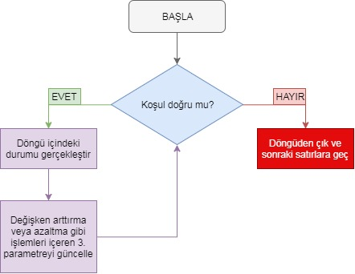

# For Döngüsü

Bu döngünün basit örneklerini daha önce görmüştük. Şimdi ayrıntılı inceleyelim.

2 farklı for döngüsü vardır. İlk for döngüsü, Java’nın ilk versiyonundan beri var olan geleneksel tarzdaki for döngüsüdür. Diğeri ise JDK 5 ile eklenen for-each döngüsüdür.

Geleneksel for döngüsünün yapısı şu şekildedir:

```java
for ( [döngü başlangıcı] ; [döngü koşulu] ; [döngü adımı] )
{
	[döngüye girecek kodlar]
}
```

For döngüsü şu şekilde işler: İlk olarak döngüde sayaç işlevi görecek bir değişken oluşturulur. Bu değişkenin ilk değeri _[döngü başlangıcı]_ ile belirtilen kısımda verilir. Bu değişken _[döngü adımı]_ kısmında isteğe göre artırılır veya azaltılır. Döngünün hangi koşulda çalışacağı ise [döngü koşulu] kısmında boolean bir ifadeyle belirtilir. 

For döngüsünü akış şemasını inceleyelim.





​																                            	**For Döngüsü Akış Şeması**


Aşağıdaki örneği inceleyelim:

```java
for (int i = 1; i < 10; i++)
{
	System.out.println(i);
}
```

Bu örnekte int türünde **_i_** isminde bir döngü sayacı oluşturulur. Bu sayaç, döngünün her adımında **_i++_** ifadesiyle 1 artırılır. Bu döngü **_i_** sayacının değeri 10’dan küçük olduğu sürece çalışır. Bu döngü çalıştırıldığı zaman çıktısı aşağıdaki gibi olur:

```java
1
2
3
4
5
6
7
8
9
```

Aşağıdaki bir başka örneği inceleyelim:

Basit bir çarpım tablosu oluşturalım.

```java
for(int a=1; a<=10; a++) {
	System.out.print(a+"\t");
}
System.out.println();
for(int b=1; b<=10; b++) {
	System.out.print(b*2+"\t");
}
System.out.println();
for(int c=1; c<=10; c++) {
	System.out.print(c*3+"\t");
}
System.out.println();
for(int d=1; d<=10; d++) {
	System.out.print(d*4+"\t");
}
System.out.println();
for(int e=1; e<=10; e++) {
	System.out.print(e*5+"\t");
}
```

**Çıktı**

```java
1	2	3	4	5	6	7	8	9	10	
2	4	6	8	10	12	14	16	18	20	
3	6	9	12	15	18	21	24	27	30	
4	8	12	16	20	24	28	32	36	40	
5	10	15	20	25	30	35	40	45	50	
```

Şimdi bu çarpım tablosunu iç içe for döngüsü kullanarak daha pratik şekilde yapalım:

```java
for(int a=1; a<=5; a++) {
	for(int b=1; b<=10; b++) {
		System.out.print((b*a)+"\t");
	}
	System.out.println();
}
```

**Çıktı**

```java
1	2	3	4	5	6	7	8	9	10	
2	4	6	8	10	12	14	16	18	20	
3	6	9	12	15	18	21	24	27	30	
4	8	12	16	20	24	28	32	36	40	
5	10	15	20	25	30	35	40	45	50	
```

**İç içe döngülerin çıktılarını hesaplarken adım adım gitmek gerekir.** Öyle ki;

**a = 1 iken;**

b = 1 için ekrana a*b = 1*1 = **1** yazdır. Tab kadar boşluk bırak.

**a = 1 iken;**

b = 2 için ekrana a*b = 1*2 = **2** yazdır. Tab kadar boşluk bırak.

**a = 1 iken;**

b = 3 için ekrana a*b = 1*3 = **3** yazdır. Tab kadar boşluk bırak.

...

**a = 1 iken;**

b = 10 için ekrana a*b = 1*10 = **10** yazdır. Tab kadar boşluk bırak.

Alt satıra geç. Dıştaki döngüyü kontrol et. a = 2 ve a<=5 olduğuna göre;

**a = 2 iken;**

b = 1 için ekrana a*b = 2*1 = **2** yazdır. Tab kadar boşluk bırak.

**a = 2 iken;**

b = 2 için ekrana a*b = 2*2 = **4** yazdır. Tab kadar boşluk bırak.

**a = 2 iken;**

b = 3 için ekrana a*b = 2*3 = **6** yazdır. Tab kadar boşluk bırak.

...

**a = 2 iken;**

b = 10 için ekrana a*b = 2*10 = **20** yazdır. Tab kadar boşluk bırak.

Alt satıra geç. Dıştaki döngüyü kontrol et....

gibi kontrol aşamaları bizleri karşılar.

For döngüsünün içindeki 3 kısmın çalıştırılma sırası şu şekildedir:

- İlk olarak **_[döngü başlangıcı]_** kısmı çalışır. Bu kısım sadece bir kez çalıştırılır, döngü boyunca bir daha çalıştırılmaz.
- Daha sonra **_[döngü koşulu]_** kısmı çalıştırılır. Eğer sonuç **true** ise döngüye girer. Bu kısım her döngünün başında tekrar kontrol edilir. Eğer sonuç **false** ise döngü sonlandırılır.
- Her döngünün sonunda **_[döngü adımı]_** kısmı çalıştırılır. Döngüde en son çalışan kısım burasıdır.

Şunu da belirtmek gerekir ki, **_[döngü başlangıcı]_** kısmında oluşturulan değişkenin kapsamı for döngüsüyle sınırlıdır. Bu değişkene for döngüsü dışında ulaşılamaz.

## For Döngüsü Varyasyonları

Geleneksel for döngüsünün farklı varyasyonları olabilir. Döngünün içinde 3 farklı kısım olduğundan bahsetmiştik. Bu kısımların hiçbiri zorunlu değildir. Aşağıdaki örnekleri inceleyelim:

```java
int i = 1;
for ( ; i < 10; i++)
{
	System.out.println(i);
}
```

Bu örnekte döngü sayacı, for döngüsünden önce oluşturulmuştur. Ayrıca **_[döngü başlangıcı]_** kısmının boş bırakıldığına dikkatinizi çekerim. Bu durumda döngü sayacı olarak döngünün dışında oluşturulan bir değişken kullanılır, ilk değeri de yine döngüden önce verilmiştir. Şunu da belirtelim ki, for döngüsünü bu örnekte olduğu gibi kullanırsanız, döngü sayacına for döngüsünden sonra da erişebilirsiniz.

**Çıktı**

```java
1
2
3
4
5
6
7
8
9
```

Bir diğer varyasyonda aşağıdaki gibidir..

Bu örnekte ise hem **_[döngü başlangıcı]_** kısmının hem de **_[döngü adımı]_** kısmının boş bırakıldığını görüyoruz. Döngü sayacını parantez içinde artırmak yerine, döngü kodlarının içinde artırıyoruz.

```java
int i = 1;
for ( ; i < 10; )
{
	System.out.println(i);
	i++;
}
```

**Çıktı**

```java
1
2
3
4
5
6
7
8
9
```

Son varyasyon aşağıdaki örnek kodda gösterilmiştir.

Bu örnekte ise bütün kısımların boş bırakıldığını görüyoruz. Bu tarz for döngüleri sonsuz döngü oluşturur. Sonsuz döngü, hiçbir koşulda sona ermeyen döngü demektir. Bu döngüde hiçbir koşul test edilmediği için döngü her zaman çalışır. Yani, eğer bu kodu çalıştırırsanız, bilgisayarınız sonsuza kadar bu döngüyü işletecektir.

```java
for ( ; ; )
{
	// sonsuz döngü
}
```

### Kaynakça

- [Kaynak Linki](https://merttopuz.com/yazilim/java/java-donguler-for-dongusu)

  
